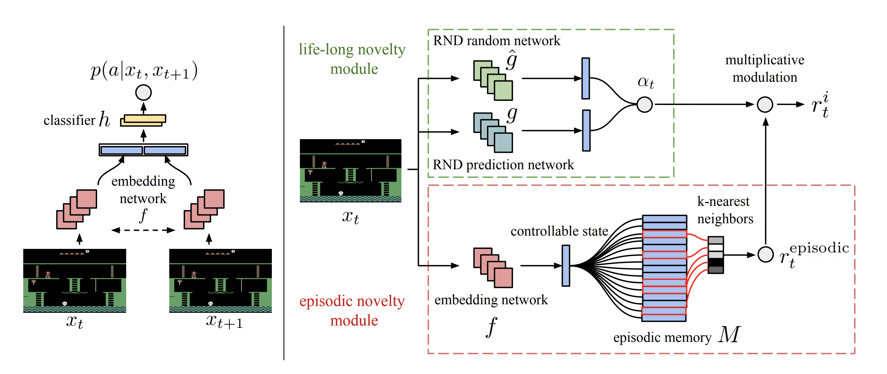

## [Never Give Up: Learning Directed Exploration Strategies](https://arxiv.org/abs/2002.06038)

THE NEVER-GIVE-UP INTRINSIC REWARD


R2D2 in synchronous way.

**Requirements**
```
# RL
stable-baselines3
torch
mpi4py

# Env
gym==0.17.2
ale-py
atari-py

# Util
opencv-python
matplotlib
tensorboard
```

After installing requirements, run `python -m atari_py.import_roms roms` import all supported ROMs.

DOCS TODO:
Instruction to install
- roms
- gym
- ale-py
- mujoco
- requirements.txt
- pip3 install -e .
- baselines
